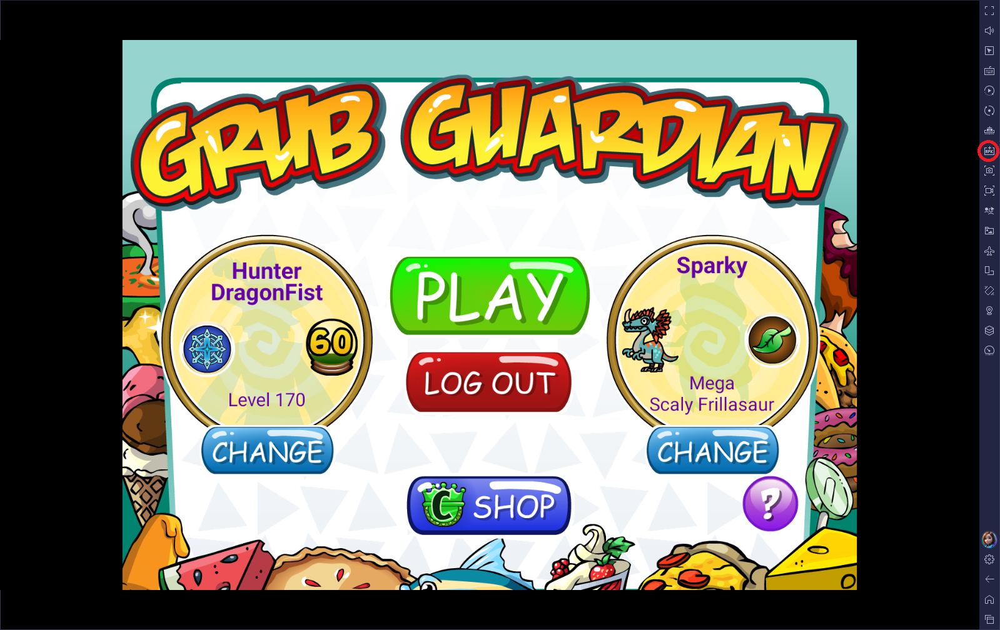

# Grub Guardian Automation Bot

This is a personal project of mine where I am designing a Python automation bot that plays the mobile game **Grub Guardian** (Wizard101) autonomously, farming Energy Elixirs without human input.

## Overview

This bot uses **OpenCV's template matching** to read the game's GUI in real time, identify on-screen state, and dispatch the appropriate inputs via **PyAutoGUI** to complete a full game loop. It runs against a BlueStacks Android emulator instance and loops indefinitely, yielding approximately 1 Energy Elixir per 5 runs. Energy Elixirs are a paid in-game resource (about $0.50 each), so automating high-volume farming creates measurable cost savings over time.

This current version is a working prototype focused on proving reliability of the core computer-vision and automation loop.

The strategy the bot executes is one I developed myself and published in a [YouTube guide](https://www.youtube.com/watch?v=iWpcQNuVs2g).

## Technical Highlights

- **Computer Vision:** Uses OpenCV template matching to locate and identify GUI elements (buttons, screens, prompts) at runtime — no pixel-hardcoding.
- **GUI Automation:** PyAutoGUI drives all mouse clicks and timing, reacting to detected screen state rather than following a fixed script.
- **Autonomous Loop:** The bot handles the full game cycle — start screen, level play, reward collection, and loop restart — without intervention.
- **Image Asset Pipeline:** Reference images in `imgs/` serve as templates; the bot matches them against live screenshots to determine program flow.

## Impact

- Helped approximately 20 community members deploy and run the bot successfully.
- Supported setup and troubleshooting across different PC and BlueStacks configurations.
- Real-world usage feedback from other players informed improvements to the prototype and plans for the future of this project.

## Requirements

- Python 3.10.6
- BlueStacks (Nougat 32-bit instance, Fullscreen, 1920x1080)
- Grub Guardian installed via Amazon Appstore on BlueStacks
- In-game: Mega Life Pet, Wysteria Map Pack, and Star Guardian unlocked

Install dependencies:
```
python -m pip install opencv-python numpy pyautogui
```

## Usage

1. Install Grub Guardian on BlueStacks (see setup guide below).
2. Launch the game, log in, and navigate to the Wysteria Map page (shown below).

    

3. Open the repository folder in your terminal or VS Code, then run:
    ```
    python "Grub Guardian.py"
    ```

The bot will loop through Tanglewood Way autonomously.

## Future Plans

- Package the project as a standalone `.exe` so it can be run without setting up a Python environment manually.
- Improve robustness with better state detection, fallback handling, and recovery logic when the emulator or game state desynchronizes.
- Add configurable settings (resolution profile, timing, confidence thresholds) to reduce hardcoded assumptions.
- Expand logging and run analytics to track performance over long sessions.

## Guide to Installing Grub Guardian on BlueStacks
**Disclaimer:** These steps will likely not work for players outside of the US.

1. Download and install [BlueStacks](https://support.bluestacks.com/hc/en-us/categories/4407981230349-BlueStacks-X) to your PC.
2. Open 'BlueStacks Multi-Instance Manager'
3. In the 'Multi Instance Manager', press the blue '+Instance' button (Shown below).

    

4. If a pop-up appears asking if you want to create a Fresh Instance or Clone Instance, click Fresh Instance.
5. Choose Android version 'Nougat 32-bit.' This ensures that you are on the correct version of Android for the game.
6. **(Optional)** Change CPU Cores to Low, Memory Allocation to Basic, and Performance Mode to Low to conserve resources.
7. Start the BlueStacks instance you just created.
8. In a **PC browser**, download the [Amazon Appstore App](<https://www.amazon.com/gp/mas/get/amazonapp>) for Android.
9. Click the 'Install APK' button on the right side of your BlueStacks Instance (shown below).

    

10. Navigate to where you downloaded the Amazon Appstore App and click it to install it to BlueStacks.
11. Once it is installed, open the Amazon Appstore App and Login. Then, search "Grub Guardian" in the app's searchbar and install it.
12. Grub Guardian should now be installed on your BlueStacks instance and be ready to play.

## Known Issues
- None currently

## Dependencies
| Library | Purpose |
|---|---|
| [OpenCV](https://pypi.org/project/opencv-python/) | Template matching / screen reading |
| [PyAutoGUI](https://pyautogui.readthedocs.io/en/latest/) | Mouse input automation |
| [NumPy](https://numpy.org) | Array operations for image data |
| [Time](https://docs.python.org/3/library/time.html) | Timing and delays |

## Resources
- [Python 3.10](https://www.python.org/downloads/)
- [BlueStacks](https://support.bluestacks.com/hc/en-us/categories/4407981230349-BlueStacks-X)
- [Amazon Appstore for Android](https://www.amazon.com/gp/mas/get/amazonapp)
- [Community BlueStacks setup guide](https://www.reddit.com/r/Wizard101/comments/12tj3s1/a_semicomprehensive_guide_to_playing_grub/) (by AmazingBadgamer)
- [Tanglewood Way farming strategy](https://www.youtube.com/watch?v=iWpcQNuVs2g) (my YouTube guide)