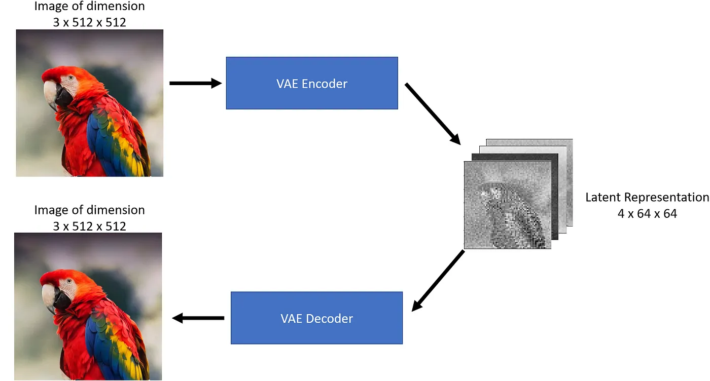

# VAE Image Compression Research Project

This project explores lossy image compression using Stable Diffusion's Variational Autoencoder (VAE), then evaluates reconstruction quality with quantitative image metrics.

## Overview

This work was developed as a year-long research project for the West Central Regional Science Fair at the Arkansas School for Mathematics, Sciences, and the Arts.

The core pipeline compresses input images into latent space with a Stable Diffusion VAE, reconstructs them, and compares outputs against originals. The results are used to study quality-vs-size tradeoffs across compression formats.



The implementation uses RunwayML Stable Diffusion v1.5 (pruned-emaonly). The latent scaling constant follows the approach from [High-Resolution Image Synthesis with Latent Diffusion Models](https://arxiv.org/abs/2112.10752).

For full methodology and analysis, see the accompanying paper: lossy_image_compression_paper.pdf.

## Technical Highlights

- Stable Diffusion VAE-based img2img compression and reconstruction.
- Multi-format output comparison including PNG and WebP.
- Automated quality scoring with SSIM, MSE, and PSNR.
- File size tracking to evaluate practical compression performance.
- Modular architecture separating orchestration and metric logic.

## Project Structure

- main.py: Runs the full experiment and reporting workflow.
- vae_module.py: Handles latent encode/decode and reconstruction logic.
- friqa_module.py: Computes image quality metrics and comparisons.
- images/: Input assets used for evaluation.
- output/: Reconstructed images and generated outputs.
- logbook.md: Research notes and iterative development record.

## Requirements

- Python 3.6+
- opencv-python
- numpy
- diffusers
- transformers
- fastdownload
- pandas
- torch
- matplotlib

Install dependencies:

```bash
python -m pip install opencv-python numpy diffusers transformers fastdownload pandas torch matplotlib
```

## Usage

1. Open the img_compression_research_project folder.
2. Run main.py.

Notes:

- The first run may download model weights and take extra time.
- Existing files in output/ may be overwritten.

## Method

1. Encode the original image into latent space using the VAE.
2. Decode latents back into a reconstructed image.
3. Compare original vs reconstructed output with SSIM, MSE, and PSNR.
4. Analyze visual quality and file size changes together.

## Acknowledgements

Image sources:

- [Squirrel](https://upload.wikimedia.org/wikipedia/commons/1/1c/Squirrel_posing.jpg)
- [Rockefeller Center](https://upload.wikimedia.org/wikipedia/commons/thumb/0/05/View_of_Empire_State_Building_from_Rockefeller_Center_New_York_City_dllu.jpg/798px-View_of_Empire_State_Building_from_Rockefeller_Center_New_York_City_dllu.jpg)
- [Neon](https://upload.wikimedia.org/wikipedia/commons/thumb/d/df/Neon.JPG/799px-Neon.JPG)
- [Starry Night](https://upload.wikimedia.org/wikipedia/commons/thumb/e/ea/Van_Gogh_-_Starry_Night_-_Google_Art_Project.jpg/757px-Van_Gogh_-_Starry_Night_-_Google_Art_Project.jpg)
- [Alto Saxophone](https://upload.wikimedia.org/wikipedia/commons/thumb/e/e6/Alto_saxophone-E_1685-IMG_7092-gradient.jpg/600px-Alto_saxophone-E_1685-IMG_7092-gradient.jpg)

Libraries and frameworks:

- [OpenCV](https://opencv.org)
- [NumPy](https://numpy.org)
- [Diffusers](https://github.com/huggingface/diffusers)
- [Transformers](https://github.com/huggingface/transformers)
- [fastdownload](https://pypi.org/project/fastdownload/)
- [pandas](https://pandas.pydata.org/docs/getting_started/install.html)
- [PyTorch](https://pytorch.org)


