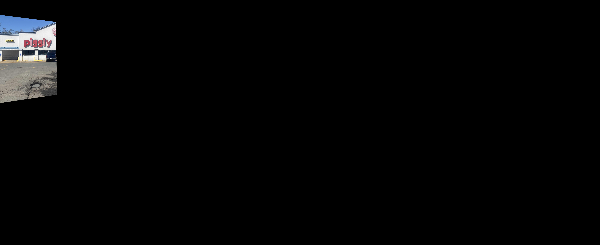
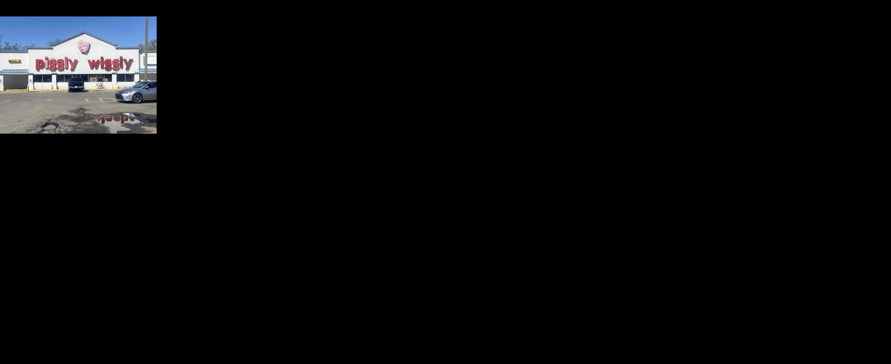
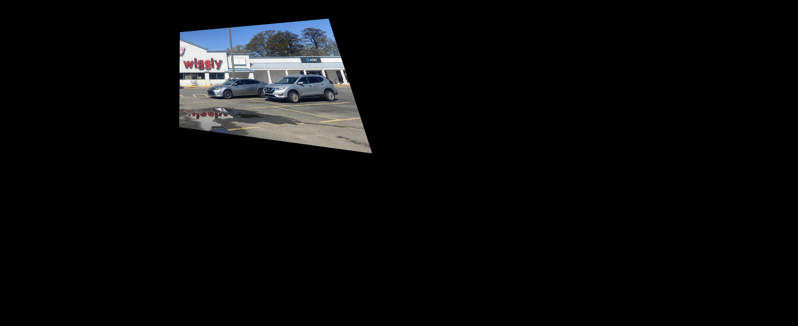
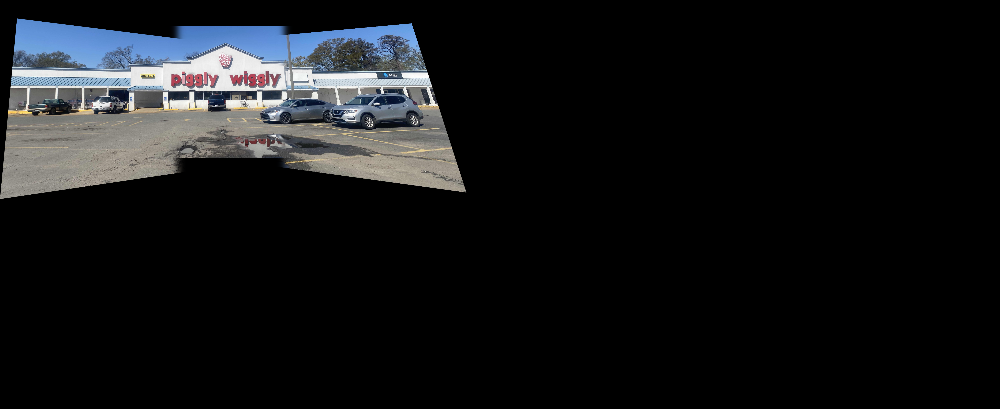

# Images to Panorama

This project builds a panorama from overlapping images using a custom computer vision pipeline implemented in Python.

## Overview

Created for a Graphics Programming course, this project focuses on image alignment, stitching, blending, and post-processing to produce a clean final panorama without shrinking source images.

For a deeper walkthrough, see imgs_2_panorama.pdf.

## Technical Highlights

- Keypoint detection and feature matching between adjacent image pairs.
- Geometric translation and placement onto a shared output canvas.
- Overlap handling and blending to reduce visible seams.
- Automatic crop cleanup to remove black borders from the stitched output.

## Project Structure

- pano.py: Main panorama stitching pipeline.
- input_imgs/: Input images used for stitching.
- output_imgs/: Intermediate and final outputs.
- supplemental_code/: Supporting coursework implementations.

## Requirements

- Python 3.6+
- numpy
- opencv-python

Install dependencies:

```bash
python -m pip install numpy opencv-python
```

## Usage

1. Open the imgs_2_panorama folder.
2. Run pano.py.
3. Check output_imgs/ for intermediate visualizations and final panorama results.

## Method

1. Match keypoints between left-center and center-right images.

   

2. Estimate relative placement and transform images onto a common canvas.

   
   
   

3. Blend overlapping regions to reduce artifacts.

   

4. Crop black padding from the stitched image.

   
