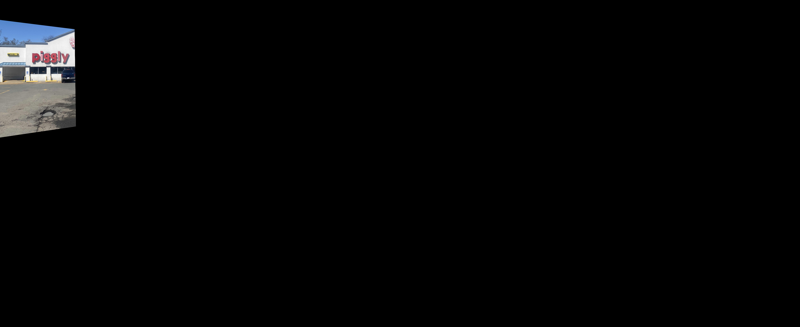
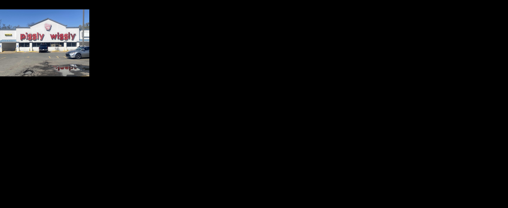
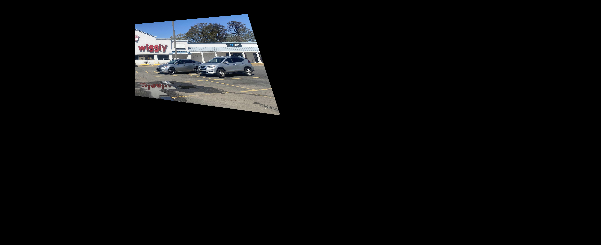

# imgs_2_panorama

*This markdown file is meant to serve as a quick summary of the pdf presentation listed within this file*

This assignment was created for a Graphics Programming class focusing on using Python and various libraries to achieve different Computer Vision effects and functions.

This specific assignment required the use of Numerical Python, known as NumPy and OpenCV, known as cv2.

For my sample images, I used three images of one of the last Piggly Wiggly supercenters that I took that Spring Break.

The project required me to take three different overlapping photos of a single location and combine the images into a single panorama image, without making the original images smaller.

To achieve this goal, I first created keypoint matches between the leftmost and center images, as well as a separate keypoint match between the center and rightmost images. 

As shown in the above image, I was able to create matches of key points between the two outer images and the center image.

These keypoints allowed me to find where to place the images in order to correctly line them up to be translated onto a new canvas.

      

The three above images show each image translated onto the canvas, although they were in the upper left corner. To counterract this, I attempted to merge the images together before cropping the new canvas to fit the size, as where the panorama is formed did not matter as long as the panorama was completed and could be cropped afterwards.

To merge the images, I created 2 masks that served as maps to place the outer images onto. Each mask had a section of full pixels that would fade as they got closer to the original image. This prevented the pixels from overlapping and giving uint8 overflow errors, which would result in discoloration around the merge points.

After successfully merging the images together into a single panorama, I had to crop the full image down to show just the panorama image as well as the box around it. To do this, I created bounding boxes around the panorama using contours, then removed all of the black space around the box. The following image is the final cropped panorama result.

